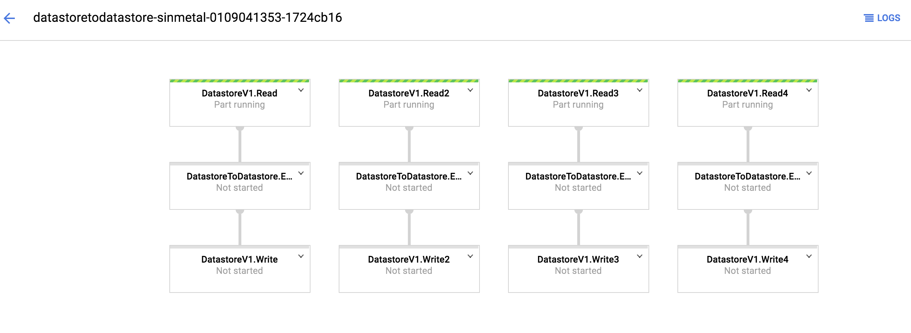

# 複数パイプラインを構築する

tag:["google-cloud-dataflow","Java"]

複数のInputデータに対して、同じ処理を適応するパイプラインの構築についてです。
例えば、DatastoreのKindやBigQueryのTableをそれぞれ処理していきたい時に利用します。



複数パイプラインを構築する方法は、Pipeline.apply()を複数行うだけです。
これだけで、複数のパイプラインを構築できます。

```
public static void main(String[] args) {
    Pipeline p = Pipeline.create(
            PipelineOptionsFactory.fromArgs(args).withValidation().create());

    p.apply(Create.of("Hello", "World"))
            .apply(MapElements.via(new SimpleFunction<String, String>() {
                @Override
                public String apply(String input) {
                    return input.toUpperCase();
                }
            }))
            .apply(TextIO.write().to("gs://sandbox-dataflow/output/1"));

    p.apply(Create.of("こんにちは", "世界"))
            .apply(MapElements.via(new SimpleFunction<String, String>() {
                @Override
                public String apply(String input) {
                    return input.toUpperCase();
                }
            }))
            .apply(TextIO.write().to("gs://sandbox-dataflow/output/2"));

    p.run();
}
```

Pipelineの数はBuild時に決まっていなくてもかまいません。
例えば、以下は実行時パラメータを受け取り、その数だけパイプラインを構築している例です。

```
public static void main(String[] args) {
    DatastoreToDatastoreOptions options =
            PipelineOptionsFactory.fromArgs(args).withValidation()
                    .as(DatastoreToDatastoreOptions.class);
    String[] kinds = options.getInputKinds().split(",");
    Pipeline p = Pipeline.create(options);
    for (String kind : kinds) {
        KindExpression kindExpression = KindExpression.newBuilder().setName(kind).build();
        Query getKindQuery = Query.newBuilder().addKind(kindExpression).build();
        p.apply(kind, DatastoreIO.v1().read().withProjectId(options.getInputProjectId()).withQuery(getKindQuery))
                .apply(new EntityMigration())
                .apply(DatastoreIO.v1().write().withProjectId(options.getOutputProjectId()));
    }
    p.run();
}
```

## Resource

https://github.com/sinmetal/pug2pug