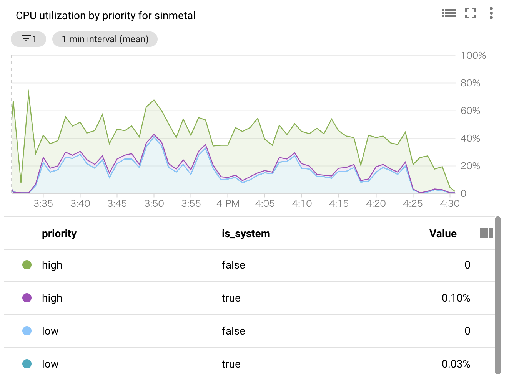
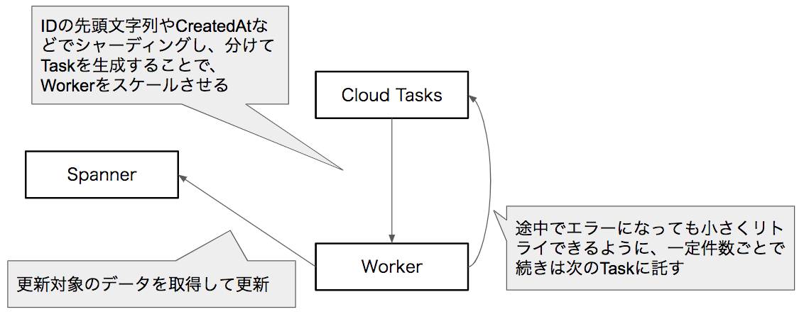
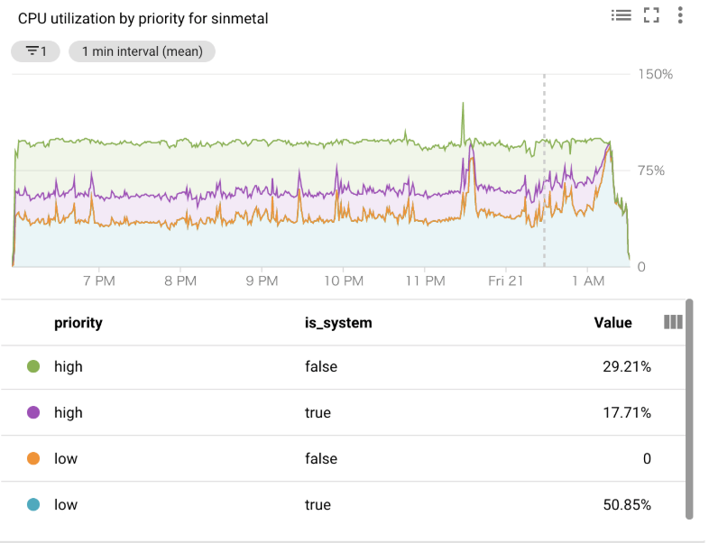
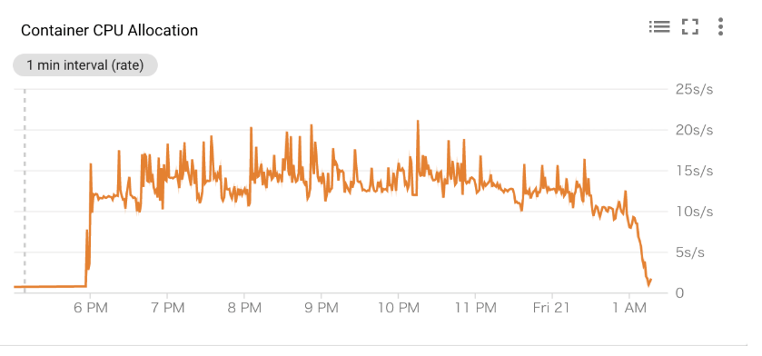
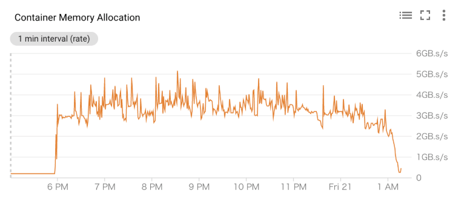
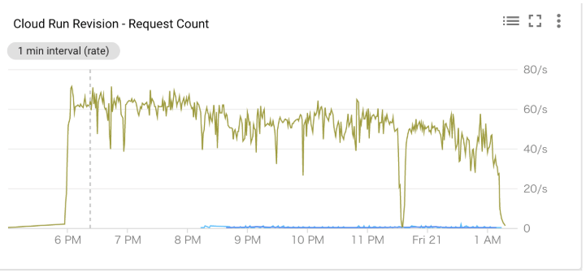
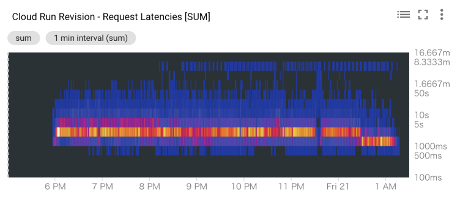

# Spanner Data Migration Benchmark by sinmetal

tag["google-cloud-spanner"]

データがすでに充分入っているTableに対して、カラムの追加時のデフォルト値の設定などのデータマイグレーションを行う時にどのような手法が取れて、どのぐらい時間がかかりそうか？を試したノート。

`Deprecated`

この記事の内容を試した時は Partitioned DMLが10分ぐらいでAbortされてたのだけど、今はAbortされなくなったので、この記事の結果通りにはならなくなっている。
なので、現在はこの記事は参考にはならない。

## Partitioned DMLを試す

カラム追加時のデフォルト値設定などにぴったりなのは [Partitioned DML](https://cloud.google.com/spanner/docs/dml-partitioned) なので、まずはこれを試してみた。
Partitoned DMLはConsoleから試すことはできないので、 [Goで作成したアプリケーション](https://github.com/sinmetal/screwdriver) で実行している。

簡単に試したい場合は [`gcloud spanner databases execute-sql --enable-partitioned-dml`](https://cloud.google.com/sdk/gcloud/reference/spanner/databases/execute-sql?hl=en) でも実行できる。

### Partitoned DMLをリトライし続けて完遂させる

TableのRowの数が多い時にPartitoned DMLが失敗してしまうが、途中までは進んでいる。
途中までは進んでいるので、徐々に進んでいけるようにクエリを書いて、 [リトライして完遂させるようにロジック](https://github.com/sinmetal/screwdriver/blob/08c4728be1c469a84f39372a1dc8728f108522eb/main.go#L43) を書いてみた。
元々Partitoned DMLは冪等性を持たせて、非同期で並列で実行するような仕組みなので、ユースケースとしてもリトライし続けても問題ないようなクエリになっている。

約3億7千万件のRowをPartitioned DMLでリトライし続けた場合、以下のような結果になった。
結構たくさんのセカンダリインデックスを持っているけど、更新対象のカラムはセカンダリインデックスを持っていない状態で実行した。
5回リトライして、1h弱で完了しているので、それなりのスピードで完了している。
Nodeの数は3つで行ったが、CPUには余裕がある感じなので、Nodeを増やしてもあまり意味はないようだ。

#### 対象のカラムにセカンダリインデックスが存在しないパターン

* NodeCount : 3
* Table Rows : 376,764,491
* Total Time : 55min
* 実行クエリ `UPDATE Tweet SET NewSimpleColumn = 5 WHERE NewSimpleColumn != 5 OR NewSimpleColumn IS NULL`

実行ログ

```
----SIMPLE PARTITIONED DML----
Start: 2019-05-30 15:33:17.706595 +0900 JST m=+0.006728408
UPDATE Tweet SET NewSimpleColumn = 5 WHERE NewSimpleColumn != 5 OR NewSimpleColumn IS NULL
PartitionedDML:Time: 10m2.373426456s
PartitionedDML:Time: 10m5.709914347s
PartitionedDML:Time: 10m3.22481861s
PartitionedDML:Time: 10m4.758418806s
PartitionedDML:Time: 10m5.501749715s
PartitionedDML:Time: 4m56.639732699s
Success: RowCount:2741553, AbortCount:5 RetryCount:0
End: 2019-05-30 16:28:35.674958 +0900 JST m=+3318.215036112
```

Tableのスキーマ

```
CREATE TABLE Tweet (
    Id STRING(MAX) NOT NULL,
    Author STRING(MAX) NOT NULL,
    CommitedAt TIMESTAMP NOT NULL OPTIONS (allow_commit_timestamp=true),
    Content STRING(MAX) NOT NULL,
    Count INT64 NOT NULL,
    CreatedAt TIMESTAMP NOT NULL,
    Favos ARRAY<STRING(MAX)> NOT NULL,
    NewColumn2 INT64,
    NewSimpleColumn INT64,
    SchemaVersion INT64,
    ShardCreatedAt INT64 NOT NULL,
    Sort INT64 NOT NULL,
    UpdatedAt TIMESTAMP NOT NULL,
) PRIMARY KEY (Id)

CREATE INDEX TweetAuthor 
ON Tweet (
    Author
)

CREATE INDEX TweetAuthorSort 
ON Tweet (
    Author,
    Sort
)

CREATE INDEX TweetNewColumn2 
ON Tweet (
    NewColumn2
)

CREATE INDEX TweetSchemaVersion 
ON Tweet (
    SchemaVersion
)

CREATE INDEX TweetShardCreatedAtAscCreatedAtDesc 
ON Tweet (
    ShardCreatedAt,
    CreatedAt DESC
)

CREATE INDEX TweetShardCreatedAtAscUpdatedAtDesc 
ON Tweet (
    ShardCreatedAt,
    UpdatedAt DESC
)

CREATE INDEX TweetSort 
ON Tweet (
    Sort
)
```



#### 対象のカラムにセカンダリインデックスが存在するパターン

次に試したのは更新対象のカラムにセカンダリインデックスが存在するパターン。
これはセカンダリインデックスがないケースと比べると、ものすごく時間がかかるようになる。
10分間で100万件程度しか進まず、3000分ぐらいかかりそうだったので、途中で実行をやめている。

実行ログ

* NodeCount : 3
* Table Rows : 376,764,491
* Total Time : ...
* 実行クエリ `UPDATE Tweet SET NewColumn2 = 0 WHERE NewColumn2 != 0 OR NewColumn2 IS NULL`

```
----SIMPLE PARTITIONED DML----
Start: 2019-06-24 13:28:44.198415 +0900 JST m=+0.004561462
UPDATE Tweet SET NewColumn2 = 0 WHERE NewColumn2 != 0 OR NewColumn2 IS NULL
PartitionedDML:Time: 10m3.404024974s
PartitionedDML:Time: 10m2.562370323s
PartitionedDML:Time: 10m4.885554348s
PartitionedDML:Time: 10m1.777834599s
PartitionedDML:Time: 10m2.580227449s
PartitionedDML:Time: 10m3.92195031s
PartitionedDML:Time: 10m2.295081914s
PartitionedDML:Time: 10m2.711362346s
PartitionedDML:Time: 10m1.995865412s
PartitionedDML:Time: 10m4.702026829s
PartitionedDML:Time: 10m2.479155181s
PartitionedDML:Time: 10m1.707703942s
PartitionedDML:Time: 10m2.322350525s
PartitionedDML:Time: 10m4.398851906s
PartitionedDML:Time: 10m4.990540858s
PartitionedDML:Time: 10m2.4777585s
PartitionedDML:Time: 10m2.92645609s
PartitionedDML:Time: 10m3.195957211s
PartitionedDML:Time: 10m3.384940183s
PartitionedDML:Time: 10m3.500095481s
```

### Partitioned DML まとめ

* 100万件ぐらいまではさくっと実行できて非常に便利。
* 100万件を超えると1回の実行で終わらない可能性が出てくるので、注意した方がよさそう。
* 冪等性を考慮して実行することになるが、リトライもするようにしておいた方が無難。
* 対象のカラムにセカンダリインデックスが存在する場合、実行がかなり遅くなるので、注意する必要がある。
* DELETEをする場合、Tableにセカンダリインデックスが1つでもあると実行に時間がかかるようになるので、 `DELETEは注意が必要` 。
* 新たにカラムを追加してデフォルト値を設定し、セカンダリインデックスを貼りたい場合、 `カラム追加->デフォルト値設定->セカンダリインデックス追加` の順番がよさそう。

## 自分でデータマイグレーションアプリケーションを作成する

Partitioned DMLで難しいデータマイグレーションを行う場合、自分でアプリケーションを書くことになる。
例えば、以下のようなケース。

* 形態素解析などSQLでは難しいことをやる必要がある
* 複数のTableが絡んでくる

その他にもPartitioned DMLと比べて以下のようなメリット・デメリットがある

メリット

* Nodeの数を増やせばスケールする
* Spannerへの負荷を調整できる
* ロジックを書くので、複雑な処理も可能

デメリット

* ロジックをごりごり書く必要がある
* Spanner以外のコンピューティングリソースも必要

アプリケーションの構成は様々なものが考えられるが、今回試したのは以下のようなQueueを利用するアーキテクチャ



SpannerのNodeの数やTableのRowの数は、Partitioned DMLの時と同じものを利用している。
Primary KeyをUUIDにしているので、00~ffまでの256通りにシャーディングして並列に実行していく。
WorkerとしてはCloud Runを利用した。
更新処理としては1000件ずつ取得して、更新していく。
更新するカラムは複数あり、セカンダリインデックスがあるカラムも含む。 [実際のソースコード](https://github.com/sinmetal/gatling-nail-gun/blob/8c5e8fcc61ed468f4402f0344b5e0538c3410b2c/fire_api.go#L103)

すべてのデータを更新するのに7.5hかかった。
SpannerのNodeのCPU利用率が100%になっているので、Nodeを増やせばもっと早く終わらせることもできそう。







## まとめ

Partitioned DMLは便利だけど、銀の弾丸ではない。
特にセカンダリインデックスが絡む更新はかなり時間がかかるし、Transaction Abortが発生するため、どのように実行するか考える必要がある。
セカンダリインデックスが絡む更新を早く終わらせたいなら、データマイグレーションアプリケーションを書いた方がよさそう。