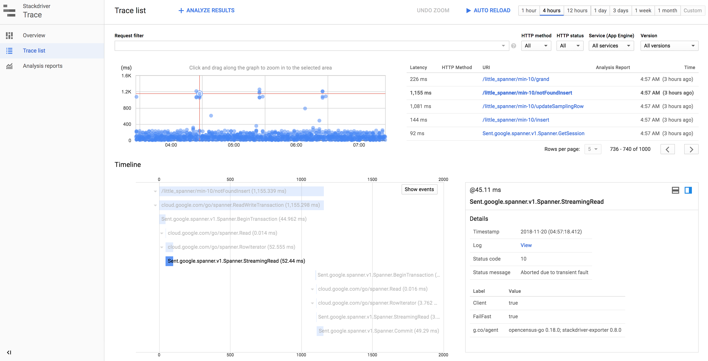

# Transaction Abort 探検記

tag["google-cloud-spanner"]

Spannerを利用しているといくつかの理由で、TransactionがAbortされることがある。
この探検記はどのようなことをするとAbortされるのか？Abortされると何が起こるのかを記す。

## Aborted due to transient fault

`Aborted due to transient fault` は一時的な何かによってTransactionがAbortされた時に出てくるエラー。
[公式ドキュメントのTransactions](https://cloud.google.com/spanner/docs/transactions?hl=en) を読むと、このエラーが発生しそうな要因がいくつか書いてある。
大きく分けると以下のどちらかになる。

* 自分のApplicationのTransactionの実行の仕方が悪い
* Spanner側で何らかの理由によりAbortされた

`Spanner側で何らかの理由によりAbortされた` は稀にしか発生しないと書いてあるので、このエラーが頻発する場合、自分のApplicationに問題がある可能性が高い。

[GoのCloud Client Library](https://github.com/GoogleCloudPlatform/google-cloud-go) を利用している場合、このエラーが発生すると自動的にリトライするようになっている。

```
_, err := spanner.Client.ReadWriteTransaction(ctx, func(ctx context.Context, txn *spanner.ReadWriteTransaction) error {
    // この中がリトライされる
    return txn.BufferWrite([]*spanner.Mutation{}{})
})
```

ReadWriteTransaction内部のリトライで、Commitが成功した場合、errorにはならないので、モニタリングが甘いと `Aborted due to transient fault` が発生しているのかを検知できない。
`Spanner側で何らかの理由によりAbortされた` の場合はさほど検知する必要はないが、 `自分のApplicationのTransactionの実行の仕方が悪い` だと直す必要がある。
`Aborted due to transient fault` が発生しているかを知る方法として、OpenCencusでトレースを確認する方法がある。
Google Cloud Client LibraryにはOpenCencusが仕込んであるので、Stackdriver TraceやDataDog Traceに出力すれば確認できる。


`Status message` に `Aborted due to transient fault` を表示されており、その後、再度BeginTransactionからやり直している。
この時、 [Exponential backoff](https://en.wikipedia.org/wiki/Exponential_backoff) を行うようになっているので、少しずつリトライ間隔が伸びていく。


### 発生する可能性が高くなる自分のApplicationのLogic

#### Transactionの範囲が広い

`Aborted due to transient fault` が発生しやすくなるケースとして、まず1つ目はTransactionの範囲が非常に広くなってしまっているケースがある。
例えば、以下のクエリは指定したTableからランダムサンプリングして、1Rowを返す [TABLESAMPLE](https://cloud.google.com/spanner/docs/query-syntax#tablesample-operator) を利用している。
このクエリ、結果は1Rowだが、Explanationを見ると、Tableをフルスキャンしている。

```
SELECT * FROM Tweet0 TABLESAMPLE RESERVOIR (1 ROWS);
```


この場合、非常に広い範囲をTransactionの対象にするので、Applicationが1プロセスで同時に1txしかない場合でも、Abortされることがそれなりにある。

これを修正する方法としてはReadWriteTransactionではなるべくReadの範囲を狭くする。
これは [ベストプラクティスにもある](https://cloud.google.com/spanner/docs/sql-best-practices#avoid_large_reads_inside_read-write_transactions) し、Transactionの定石でもある。
先程のクエリの場合は、1RowランダムサンプリングしてUpdateしたいだけなので、QueryはReadWriteTransactionの前に実行し、PKを取得して、ReadWriteTransactionの中で改めてPKでReadし直せばよい。

```
var id string
sql := `SELECT Id FROM Tweet0 TABLESAMPLE RESERVOIR (1 ROWS);`
err := s.sc.Single().Query(ctx, spanner.Statement{SQL: sql}).Do(func(r *spanner.Row) error {
	return r.ColumnByName("Id", &id)
})
if err != nil {
	return err
}
_, err = s.sc.ReadWriteTransaction(ctx, func(ctx context.Context, txn *spanner.ReadWriteTransaction) error {
	row, err := txn.ReadRow(ctx, "Tweet0", spanner.Key{id}, []string{"Id", "CommitedAt"})
	if err != nil {
		return err
	}
	var t Tweet
	if err := row.ToStruct(&t); err != nil {
		return err
	}
	m := spanner.Update("Tweet0", []string{"Id", "CommitedAt"}, []interface{}{t.ID, spanner.CommitTimestamp})
	if err != nil {
		return err
	}
	return txn.BufferWrite([]*spanner.Mutation{m})
})
if err != nil {
	return err
}
```

#### NotFound

`Aborted due to transient fault` が発生しやすい2つ目のケースは、ReadWriteTransactionでReadを行ったがNotFoundだった場合。
Google Cloud Datastoreを使っていたことがある人がよくやる処理として、Transaction内でReadし、なければInsertするし、あればUpdateするという処理がある。
リトライ時の冪等性担保や、UUIDがもしぶつかったら・・・みたいな気持ちの時に書くが、Spannerでこれをやると存在しないRowのLockを取得するのが難しいからか、 `Aborted due to transient fault` になるケースがある。
SpannerにはInsertが明示的にあるので、Insertを利用して、ぶつかったら、Updateする方が無難な気がする。

```
id := uuid.New().String()
_, err := s.sc.ReadWriteTransaction(ctx, func(ctx context.Context, txn *spanner.ReadWriteTransaction) error {
	ml := []*spanner.Mutation{}
	row, err := txn.ReadRow(ctx, "Tweet0", spanner.Key{id}, []string{"Id"})
	if err != nil { // ここで Aborted due to transient fault が発生する
        // 無かったら、InsertMutationを作成する
		if spanner.ErrCode(err) == codes.NotFound {
			fmt.Printf("%s is not found Tweet0\n", id)
			m, err := spanner.InsertStruct("Tweet0", Tweet{
				ID:         id,
				CreatedAt:  time.Now(),
				CommitedAt: spanner.CommitTimestamp,
			})
			if err != nil {
				return err
			}
			ml = append(ml, m)
		} else {
			return err
		}
	} else {
		t := Tweet{}
		if err := row.ToStruct(&t); err != nil {
			return err
		}
		m, err := spanner.UpdateStruct("Tweet0", &t)
		if err != nil {
			return err
		}
		ml = append(ml, m)
	}
	return txn.BufferWrite(ml)
})
if err != nil {
	return err
}
```



## Transaction was aborted. It was wounded by a higher priority transaction due to conflict on keys

おまけ

こちらはTransactionがぶつかった時にAbortされるケース。
`Aborted due to transient fault` を調べている時に、うまくTransactionをぶつけるにはどうすれば？みたいなのを試している時に、ふと思ったことを書いた記録。
試したソースコードは https://github.com/sinmetal/stxabort_playground にある。

### 条件

ReadWriteTransactionの中でQueryとInsertを行う処理をgoroutineで複数同時に実行する。
QueryとInsertするRowは以下の通り。

#### Queryたち

```
{
	Query: `SELECT * FROM MyTable@{FORCE_INDEX=MyTableBySI} WHERE SI = @param`,
	Value: "si",
},
{
	Query: `SELECT * FROM MyTable@{FORCE_INDEX=MyTableBySI} WHERE SI = @param`,
	Value: uuid.New().String(),
},
{
	Query: `SELECT * FROM MyTable@{FORCE_INDEX=MyTableBySI} WHERE SI > @param`,
	Value: "aa",
},
{
	Query: `SELECT * FROM MyTable@{FORCE_INDEX=MyTableBySI} WHERE SI > @param`,
	Value: "zz",
},
{
	Query: `SELECT * FROM MyTable WHERE PK = @param`,
	Value: uuid.New().String(),
},
{
	Query: `SELECT * FROM MyTable WHERE PK = @param`,
	Value: "pk",
},
{
	Query: `SELECT * FROM MyTable WHERE PK > @param`,
	Value: "aa",
},
{
	Query: `SELECT * FROM MyTable WHERE PK > @param`,
	Value: "pk",
},
{
	Query: `SELECT * FROM MyTable WHERE PK > @param`,
	Value: "zz",
},
```

#### InsertするMutation

```
m := spanner.Insert("MyTable",
	[]string{"PK", "SI", "V"},
	[]interface{}{"pk", "si", "v"},
)
```

### 結果

上記の条件で実行した場合、結果は以下になる。
Secondary Indexを利用しているQueryはぶつかるものとぶつからないものがあり、Primary Keyを利用しているものはぶつからない。
特におもしろいのが、 `= si` はぶつかるが、 `= pk` はぶつからないという部分。
これはエラーメッセージの中にも書いてあるが、Primary KeyをRange Scanしているかどうかで変わっている。
Secondary Indexは実態としてはTableが存在していて、Indexに含んでいるColumn + 元のTableのPKを、PKとして持っている。
そのため、 `= si` を実行した場合、内部ではSecondary IndexのTableに対して、 si Columnが `si` という文字になっているKeyのRowの一覧を取得する処理を実行し、Transactionがぶつかる。

```
2018/11/21 18:07:43 failed {Query:SELECT * FROM MyTable@{FORCE_INDEX=MyTableBySI} WHERE SI = @param Value:si}. err = 4 : txn.Commit: 4 : txn.Query: spanner: code = "Aborted", desc = "Transaction was aborted. It was wounded by a higher priority transaction due to conflict on keys in range [[si,pk], [si,pk]), column PRIMARY KEY in table MyTableBySI."
2018/11/21 18:07:47 success {Query:SELECT * FROM MyTable@{FORCE_INDEX=MyTableBySI} WHERE SI = @param Value:d24bc261-3e96-4e53-9e07-c7cb052bb401}
2018/11/21 18:08:03 failed {Query:SELECT * FROM MyTable@{FORCE_INDEX=MyTableBySI} WHERE SI > @param Value:aa}. err = 98 : txn.Commit: 98 : txn.Query: spanner: code = "Aborted", desc = "Transaction was aborted. It was wounded by a higher priority transaction due to conflict on keys in range [[si,pk], [si,pk]), column PRIMARY KEY in table MyTableBySI."
2018/11/21 18:08:05 success {Query:SELECT * FROM MyTable@{FORCE_INDEX=MyTableBySI} WHERE SI > @param Value:zz}
2018/11/21 18:08:07 success {Query:SELECT * FROM MyTable WHERE PK = @param Value:b875998e-580a-4376-8f47-a4926797cfc3}
2018/11/21 18:08:10 success {Query:SELECT * FROM MyTable WHERE PK = @param Value:pk}
2018/11/21 18:08:20 success {Query:SELECT * FROM MyTable WHERE PK > @param Value:aa}
2018/11/21 18:08:22 success {Query:SELECT * FROM MyTable WHERE PK > @param Value:pk}
2018/11/21 18:08:23 success {Query:SELECT * FROM MyTable WHERE PK > @param Value:zz}
```

というわけで、基本的にReadWriteTransactionの中では、PKを明示的に指定したQuery以外は実行しない方がよい。